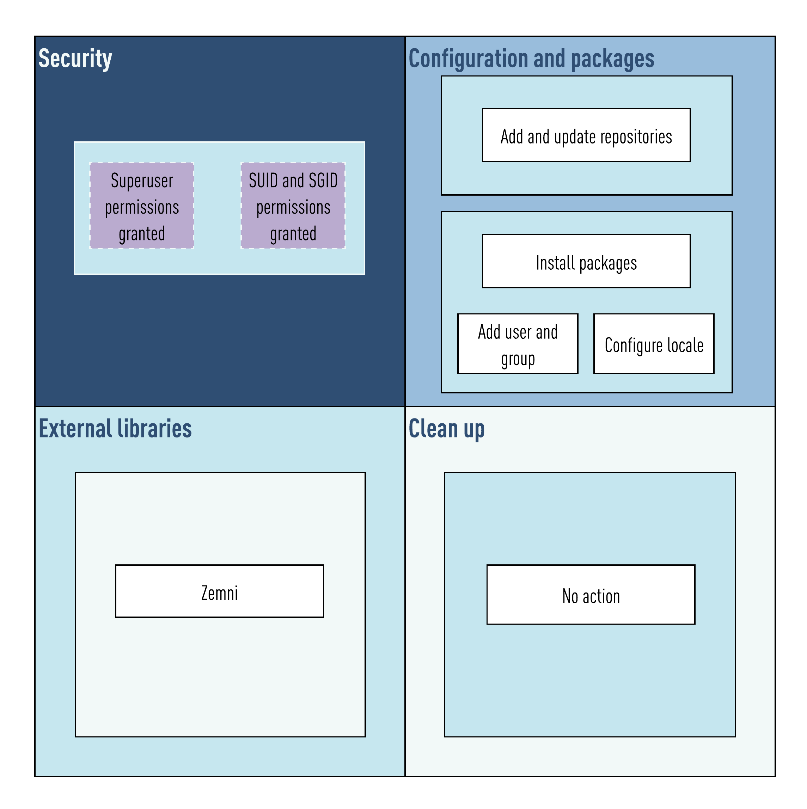

# Welcome

 

Welcome to the Cronov project. This image is part of the [Drako](https://github.com/v8tix/drako) project.

#### Prerequisites
* Docker Engine installed.

## What this guide covers
1. The Cronov image contexts.
2. Common operations.
### 1. The Cronov image contexts.
* The following figure shows these contexts:

* In this case Cronov only uses two contexts: 
  * Configuration and packages: 
    * In this context Cronov adds the repositories needed to execute the functions present on the External libraries context.  
  * External libraries. 
    * Cronov makes use of the functions from the [Zemni](https://github.com/v8tix/zemni) project to add its user and group, and then the locale.
### 2. Common operations.
* At the root directory you will find the following directories.
  * configuration:
    * Here you can change the image name and its tag. 
  * build.
    * The Docker file and the container artifacts need must be included here.
    * Also in this directory you can find the build.sh script. Execute it if you plan to build this image. 
    * Once the image was built, you can go to the executables directory.
  * executables.
    * Each script under this directory wraps a useful Docker command.
    * To give a try the container:
      * Execute the run.sh script. This starts a detached container.
      * To get a console, you will need to execute the attach.sh script.
      * :bulb: Like in SSH remote connections, you will need to write 'exit' and then press Enter to close the opened connection.
      * Once you are done with this container, there are two ways to stop it:
        * If you want to just stop it and keep this image, execute the stop.sh script, or         
        * you want to stop it and you no longer need this image, execute the delete.sh script instead.
## Authors
* Initial work
  * V8TIX - info@v8tix.com   
## License  
<a rel="license" href="http://creativecommons.org/licenses/by/4.0/">&nbsp;</a>This work is licensed under a [Creative Commons Attribution 4.0 International License](http://creativecommons.org/licenses/by/4.0/).  
  

 